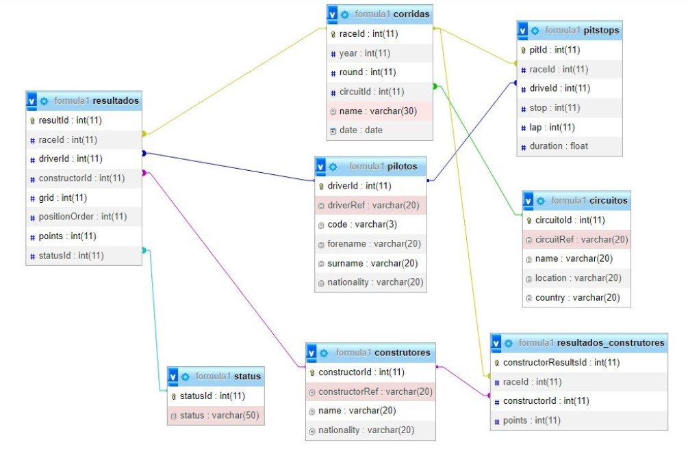

# Formula 1 Database

Neste projeto foi proposto a montagem de um dashboard com base no conjunto de dados escolhido pelo grupo, a fim de realizar uma apresentação com a exploração dos dados.

## Modelo Lógico

## Perguntas utilizadas nas pesquisas

Quais autódromos mais utilizados?

  

