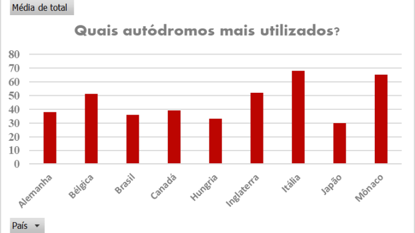

# Formula 1 Database

Neste projeto foi proposto a montagem de um dashboard com base no conjunto de dados escolhido pelo grupo, a fim de realizar uma apresentação com a exploração dos dados.

## Modelo Lógico

## Perguntas
Essas foram as perguntas utilizadas nas pesquisas e gráficos gerados a partir dos resultados obtidos

Quais autódromos mais utilizados?

  

Ranking de pilotos na primeira colocação no Grid?

  

Quais problemas mais recorrentes nos anos entre 2013-2017?

  

            
Quais construtoras realizou o pitstop mais rápido no período 2013 - 2017?           
            

  

Quais construtoras têm maior quantidade de vitórias disponível em nosso sistema?

  

            
            
